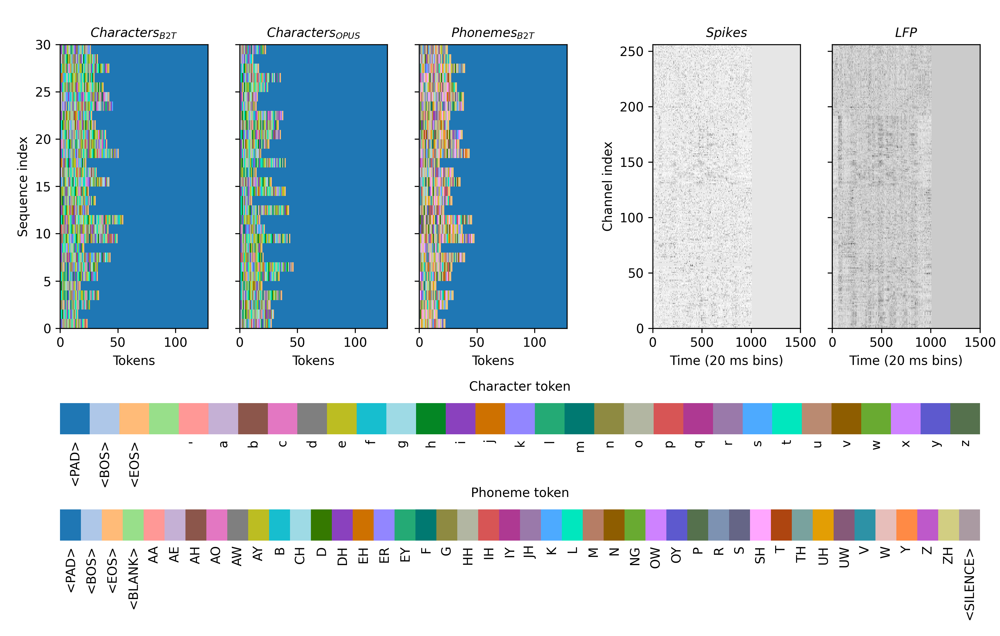

# myb2t

## Overview
This is a repository for my submission to the [2025 Brain-to-Text Kaggle competition](https://www.kaggle.com/competitions/brain-to-text-25). The objective of this competition is to create a model to decode intended/attempted speech in patients with ALS or other severe speech disorders using intracranial recordings of neural activity and transcriptions of phoneme and character sequences. For my submission, I implemented a muli-task learning (MTL) encoder-decoder transformer that uses a character-level language model conditioned on the neural activity to predict target phoneme and character sequences. The language model component was pre-trained using a subset of the the English OPUS (OpenSubtitles) corpus. This model was able to acheive a word error rate (WER) of 0.31 on a held-out test dataset.
 
## Datasets
For convenience, I've created PyTorch Dataset objects for the Brain-to-text (B2T) (`myb2t.datasets.BrainToText2025`) and OpenSubtitles (OPUS) datasets (`myb2t.datasets.OpusDataset`). The B2T dataset stores all sequences of neural activity (multi-unit spikes and LFPs) as well as sequences of character and phoneme tokens. The OPUS dataset contains only sequences of character tokens. Below is a visualization that illustrates the data available in each dataset:



The first three subplots show sequences of character or phoneme tokens for 30 example sequences (y-axis). Color indicates the identity of the token (blue represents the pad token). The last two subplots show sequences of either multi-unit spiking (second-to-last) or LFP activity (far-right) across 256 recording channels (y-axis) for a single example trial. Color represents the magnitude of neural activity.

## Model architecture
The model is fundamentally a conditional seq2seq transformer and can be broken down into these major architectural components:
- Representational learning
    - Frontend module
        - Neural activity modality gating
        - Session embedding + FiLM
        - 1D CNN (feature extraction)
        - Positional encoding (vanilla sinusoidal PE)
    - Transformer encoder (contextualizes the neural feature sequence)
- Decoding
    - Transformer decoder (autoregressive, cross-attends to encoder)
    - Output heads
        - phoneme sequence head (operates directly on the encoder output)
        - character sequence head

## Multi-task learning
One of the most important features of this model is that it optimizes multiple (2) objective functions. It minimizes CE loss for characters (primary objective) and CTC loss for phonemes (auxillary objective) with the idea being that learning an auxillary task in parallel will improve performance on the primary task ([Senner & Koltun, 2018](https://arxiv.org/abs/1810.04650v2)). The relative contribution of each objective can be tuned with the $\alpha$ parameter which scales the individual losses using this formula:
```math
L = \alpha * L_{Char.} + (1 - \alpha) * L_{Phoneme}
```
For example, setting $\alpha$=1.0 will completely disregard CTC loss computed over the predicted phoneme sequences, and conversely, setting $\alpha$=0.0 will completely CE loss computed over the predicted character sequences.
